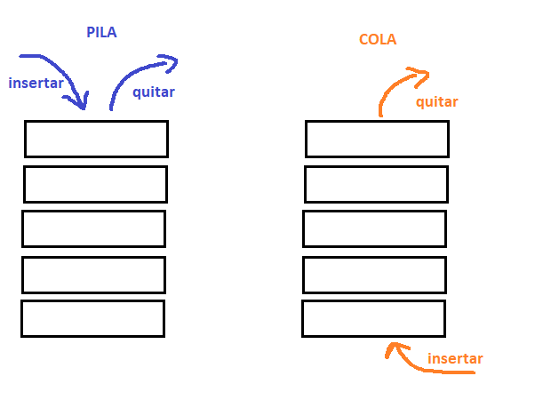

<div align="right">

</div>

# NOMBRE TP/TDA

## Repositorio de (Nombre Apellido) - (Padrón) - (Mail)

- Para compilar:

```bash
make
```

- Para ejecutar:

```bash
make 
```

- Para ejecutar con valgrind:
```bash
make valgrind-chanutron
```
---
##  Funcionamiento

Explicación de cómo funcionan las estructuras desarrolladas en el TP y el funcionamiento general del mismo.

Aclarar en esta parte todas las decisiones que se tomaron al realizar el TP, cosas que no se aclaren en el enunciado, fragmentos de código que necesiten explicación extra, etc.

Incluír **EN TODOS LOS TPS** los diagramas relevantes al problema (mayormente diagramas de memoria para explicar las estructuras, pero se pueden utilizar otros diagramas si es necesario).

### Por ejemplo:

El programa desarrolla las funciones necesarias para trabajar con una lista.
Crearla, agregar elementos, quitar elementos, etc.
Permite al usuario conocer el tamanio de la lista, y que elemento se encuentra en determinada posicion.

En el archivo `lista.c` la función `lista_crear` utiliza `calloc` para reservar la memoria necesaria para una lista e inicializar lista->nodo_inicio y lista->tamanio.

El programa luego de usar `calloc` verifica que se haya reservado la memoria correctamente, en caso contrario maneja el error, retornando NULL por ej.

```c
lista_t *lista_crear()
{	
	lista_t *lista= calloc(1, sizeof(lista_t));
	if(lista == NULL){
		return NULL;
	}

	return lista;
}
```

En el archivo `lista.c` la función `crear_nodo` utiliza `calloc` para reservar la memoria necesaria para un nodo e inicializar nodo->elemento y nodo->siguiente.
(lo que me hace pensar ahora, que la linea 35 esta de más).

```c
	nodo_t *nodo= calloc(1, sizeof (nodo_t));
	if(nodo == NULL){
		return NULL;
	}
```

<div align="center">

</div>

---

## Respuestas a las preguntas teóricas
Diagramas de lista/pila/cola

<div align="center">

</div>

<div align="center">

</div>

Complejidad:

`lista simplemente enlazada`:

insertar al inicio= O(1) cambiando el puntero y demás, como en la función propia `lista_insertar_inicio` 
obtener al inicio= O(1) lista tiene un puntero al nodo inicio, se accede a su elemento lista->nodo_inicio->elemento
eliminar al inicio= O(1)  guardar el nodo_inicio en un auxiliar, cambiar el puntero`lista->nodo_inicio =lista->nodo_inicio->siguiente`

insertar/obtener/eliminar al medio= O(n), tenes que recorrer los nodos hasta encontrar la posicion, para luego ejecutar esa acción.

insertar/obtener al final= En mi caso son O(n), porque no hice un `nodo_final` para `lista_t`, tome esta desicion porque se vió asi en la teórica pero tiene mayor complejidad computacional.
Teniendo un `nodo_final` uno accede directamente a este para insertar y  obtener.
eliminar al final= O(n), no alcanza con acceder al ùltimo y eliminarlo, el anterior al mismo debe apuntar a NULL, y para encontrar el anterior al último hay que recorrer la lista.
 


`doblemente enlazada`:
insertar/obtener/eliminar al inicio= O(1), por las mismas razones que en lista simplemente enlazada.

insertar/obtener/eliminar al medio= O(n), tenes que recorrer los nodos hasta encontrar la posicion, para luego ejecutar esa acción.

insertar/obtener/eliminar al final= O(1), para insertar al final cmabias los punteros, basicamente que el último no sea NULL, para obtener, tenes acceso directo con `nodo_final`, y para eliminar tenes acceso al anteúltimo con `nodo_final->anterior`. 


`vector dinámico`:
insertar al inicio= O(n), reservar más memoria en caso de ser necesario, luego mover todos los elementos un lugar a la derecha, n es la cantidad de elementos que tenga el vector.
obtener al inicio= O(1), se accede en la primer posicion vector[0]
borrar al inicio= O(n), hay que mover todos los elementos un lugar a la izquierda, n es la cantidad de elementos que tenga el vector.

insertar/eliminar al medio= O(n), tenes que recorrer todo el vector hasta encontrar la posicion
obtener al medio= O(1), accedes por ej vector[4]

insertar/obtener/eliminar al final= O(1), si tenes suficiente memoria, aumentas el tamanio y luego =vector[tamanio-1], para obtener lo mismo, y para eliminar tambien, podes acceder directamente a la posicion final del vector.
Si hay que redimencionar el vector, peor caso, realloc O(n). 

`pila y cola`

cola:
`cola_encolar`: O(n), porque `lista_insertar` busca el "último" y hace que ultimo apunte a ese "nuevo".
`cola_destruir`: O(n), porque `lista_destruir` recorre todos los nodos y destruye uno por uno.
El resto O(1), acceden al "inicio de la cola"

pila:
`pila_destruir`: O(n), porque `lista_destruir` recorre todos los nodos y destruye uno por uno.
El resto  0(1), se trabaja siempre con el primer elemento, al cual se tiene acceso directo.


